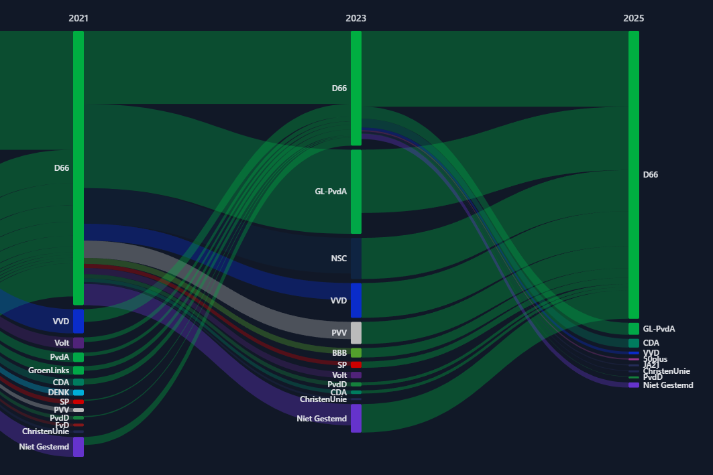

# Dutch Voter Movement Visualization

This project was created to visualize how voter support moves between parties across multiple election cycles. The main
inspiration came from the 2025 Dutch election, when D66 emerged as the winner in media narratives that suggested
voters from many major parties had switched over to D66. That prompted a simple question: were these the same voters who
had previously left D66 between 2021 and 2023?

The visualizations of the NOS focuses on one party for one election at a time, making it difficult to see the full
picture. The result is a set of interactive visualizations that make those flows easier to inspect across elections. The example
below shows D66's movement from 2021 to 2025:

The image suggests that a substantial share of the "new" support in 2025 may have come from voters who were
already backing D66 in 2021, while the D66 electorate shifts in a more right-leaning direction.

This project is primarily about the visualization itself rather than the programming. As a result, a significant portion
of the code was generated with the help of AI.