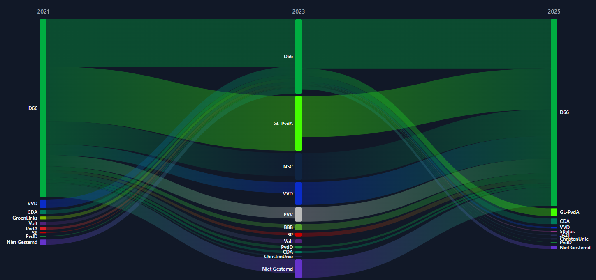

# Dutch Voter Movement Visualization

This project visualizes how voter support moves between Dutch parties across election cycles. It was created after the
2025 Dutch parliamentary election, when media narratives around D66 suggested that voters from many parties had shifted
toward the party. The project asks a broader question: how do those flows actually look across multiple elections, and
how much of the apparent change is real movement versus a continuation of existing support from two elections earlier?

The visualization of the NOS focuses on one party for one election at a time, making it difficult to see the full
picture. The result is a set of interactive visualizations that make those flows easier to inspect across elections. The
example below shows D66's movement from 2021 to 2025:

## What the app shows

The interface combines several interactive views for Dutch election data:

- Alluvial voter-flow diagrams showing how voters move between parties between election years
- Turnout and vote breakdown charts for each election
- Parliament composition views across election cycles
- Election-to-election comparison tables for vote and seat changes
- Coalition explorer to test different party combinations against majority thresholds
- Shareable URLs and export tools for SVG/CSV output
- Light/dark theme and English/Dutch language switching

## Notes

This project is primarily a data-visualization and analysis tool rather than a software-first project. A significant
part of the implementation was generated with the help of AI, while the underlying election data and narrative are the
main focus.
